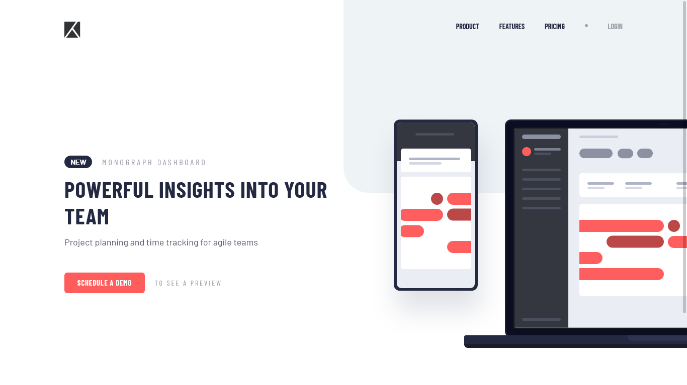

# Frontend Mentor - Project tracking intro component solution

This is a solution to the [Project tracking intro component challenge on Frontend Mentor](https://www.frontendmentor.io/challenges/project-tracking-intro-component-5d289097500fcb331a67d80e). Frontend Mentor challenges help you improve your coding skills by building realistic projects.

## Table of contents

- [Overview](#overview)
  - [The challenge](#the-challenge)
  - [Screenshot](#screenshot)
  - [Links](#links)
- [My process](#my-process)
  - [Built with](#built-with)
  - [What I learned](#what-i-learned)
  - [Continued development](#continued-development)
- [Author](#author)

## Overview

### The challenge

Users should be able to:

- View the optimal layout for the site depending on their device's screen size
- See hover states for all interactive elements on the page
- Create the background shape using code

### Screenshot

### Links

- Solution URL: [https://github.com/brandonmharrington/project-tracking-component](https://github.com/brandonmharrington/project-tracking-component)
- Live Site URL: [https://brandonmharrington.github.io/project-tracking-component](https://brandonmharrington.github.io/project-tracking-component)

## My process

### Built with

- Semantic HTML5 markup
- CSS custom properties
- Flexbox
- Mobile-first workflow
- Vanilla JS for mobile nav bar toggle

### What I learned

This project was fairly straightfoward but provided a challenge in creating a background image in a certain shape. I was able to take care of this using a :before selector on the body tag in CSS. This was also the first project I completed where I created a mobile nav bar toggle.

### Continued development

Upon completion of this project, I will continue to work on my CSS skills, positions elements on the page depending on page size, and creating mobile-first designs.

## Author

- Website - [Brandon Harrington](https://brandon-harrington.netlify.app)
- Frontend Mentor - [@brandonmharrington](https://www.frontendmentor.io/profile/brandonmharrington)
- Github - [@brandonmharrington](https://github.com/brandonmharrington)
